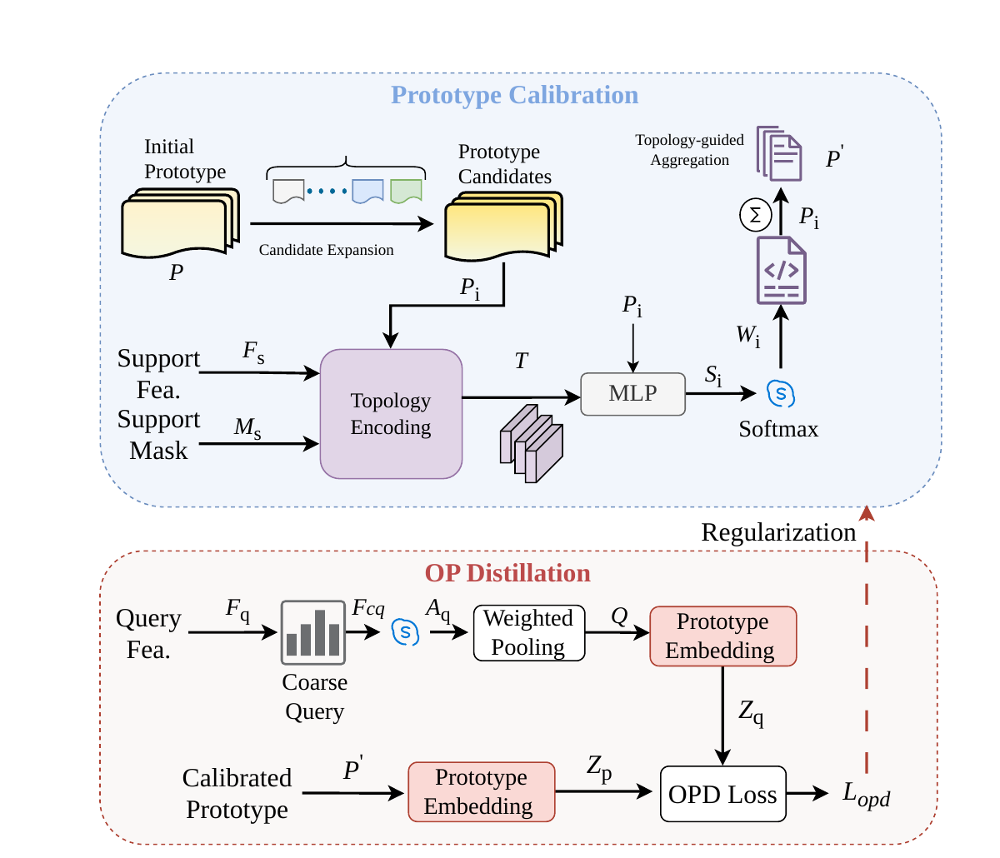

# ToPo-OPD

### Topology-Calibrated Prototype Distillation for Few-shot Point Cloud Segmentation

Official project repository for **Topology-Calibrated Prototype Distillation for Few-shot Point Cloud Segmentation**.

> The complete implementation will be released.

## Overview

Few-shot point cloud semantic segmentation (FS-PCS) aims to recognize novel semantic categories from only a few annotated support scenes. Existing prototype-based methods remain limited by two coupled issues: masked-average support prototypes can discard local topology, while coarse query states are not explicitly aligned with the support prototype space.

**ToPo-OPD** addresses both issues through topology-guided prototype calibration and on-policy prototype distillation. ToPo improves the support representation before query matching, and OPD transfers the calibrated prototype structure to the query branch during training.

## Pipeline

  

<em>ToPo-OPD jointly calibrates support prototypes with topology cues and regularizes on-policy query prototypes in a shared embedding space.</em>

### Topology-guided Prototype Calibration

ToPo expands an initial support prototype into multiple candidates and evaluates their compatibility with the masked support topology. Topology-aware weights aggregate these candidates into a calibrated prototype, reducing support-side bias while retaining structural information.

### On-policy Prototype Distillation

OPD constructs a query-side prototype from the model's current coarse activations and aligns it with the calibrated support prototype through temperature-scaled distillation. The branch is used only during training and introduces no additional inference-time path.

## Highlights

- Jointly addresses support-side prototype bias and query-side misalignment.
- Preserves structural cues through topology-aware candidate aggregation.
- Distills calibrated support knowledge into the query states visited during optimization.
- Remains compatible with standard episodic 2-way/3-way and 1-shot/5-shot protocols.
- Adds no OPD branch at inference time.

## Experimental Summary

Experiments are conducted on the S3DIS and ScanNet indoor point cloud benchmarks. The current manuscript reports the best mean IoU in seven of eight standard settings, including all four S3DIS settings and three of four ScanNet settings. Across the eight settings, ToPo-OPD improves the average mean IoU over the DPA baseline from 65.81 to 67.12.

Qualitative comparisons further show more coherent foreground regions, fewer holes, and cleaner boundaries under limited support supervision.

## Backbones and Future Experiments

The current study follows the established DGCNN-based few-shot segmentation pipeline. A Stratified Transformer backbone is also considered for stronger hierarchical point representations.

Future experiments will extend the evaluation to additional backbone families, topology neighborhood settings, prototype candidate counts, distillation temperatures, and cross-dataset generalization. Verified configurations and results will be released progressively with the complete implementation.

## Citation

Citation information will be added after the paper metadata is finalized.

## Acknowledgement

We thank the authors of [DGCNN](https://github.com/WangYueFt/dgcnn) and [Stratified Transformer](https://github.com/dvlab-research/Stratified-Transformer) for their excellent work.
